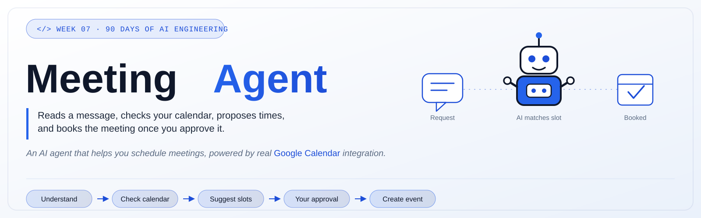

<p align="center">
  
</p>

<p align="center">
  
  
  
  
  
  
  
</p>

<p align="center">
  An AI agent that reads a meeting request, checks your <b>real</b> Google Calendar, finds genuinely available slots, and only books after you approve.<br/>
  Seventh deliverable of a <b>90-day AI Engineering roadmap</b> (Phase 1: Foundation, Week 7).
</p>

---

## 📑 Table of Contents

- [Overview](#-overview)
- [Features](#-features)
- [Demo](#-demo)
- [Installation](#️-installation)
- [Google Calendar Setup](#-google-calendar-setup)
- [How to Run](#️-how-to-run)
- [Architecture](#️-architecture)
- [Why a Real Calendar, Not Mock Data](#-why-a-real-calendar-not-mock-data)
- [Folder Structure](#-folder-structure)
- [Future Improvements](#-future-improvements)
- [Roadmap Context](#-roadmap-context)
- [Author](#-author)
- [License](#-license)

---

## 📖 Overview

**AI Meeting Agent** takes a natural-language scheduling request ("Can we have a 30-minute meeting tomorrow afternoon?"), extracts the structured details (date, duration, participants, time preference), checks **real availability on Google Calendar** via OAuth 2.0, proposes genuinely open slots, and — only after explicit human approval — creates the actual calendar event. This week moves past mock data entirely: the agent interacts with a real external system, not a simulation.

This is **Repo 7 of 10+** in a structured 90-day AI Engineering roadmap, moving from LLM fundamentals → agentic systems → deployable AI products.

---

## ✨ Features

- 🧠 **Meeting Request Understanding** — extracts intent, participants, duration, date, and time preference from natural language
- 🧾 **Structured Extraction (Pydantic)** — messy phrases like "tomorrow afternoon" are normalized into a validated `MeetingRequest` schema (date, timezone, preferred start/end window)
- 📅 **Real Google Calendar Integration** — OAuth 2.0 authenticated access to actual calendar events, not mock data
- 🔍 **Smart Slot Finding** — checks real free/busy data and proposes only genuinely available windows
- ✅ **Human-Approved Booking** — `create_calendar_event()` never executes automatically; the agent proposes options, the user picks one, only then is the real event created
- 🚫 **Conflict-Safe** — never books over an existing event, and never creates the option the user explicitly rejected
- 🔐 **Credentials Never Committed** — `credentials.json` and `token.json` are gitignored from the start
- 🧪 **Evaluated against 10 real-world scheduling scenarios** — including conflicts, missing information, ambiguous dates, and rejected suggestions

---

## 🎥 Demo

*(Add a screenshot or short GIF/video here once available)*

```
assets/screenshots/
```

---

## 🛠️ Installation

```bash
# 1. Clone the repository
git clone https://github.com/Hamna-Munir/07-AI-Meeting-Agent.git
cd 07-AI-Meeting-Agent

# 2. Create a virtual environment
python -m venv venv
source venv/bin/activate      # On Windows: venv\Scripts\activate

# 3. Install dependencies
pip install -r requirements.txt

# 4. Configure environment variables
cp .env.example .env
# then add your Groq/LLM API key
```

---

## 🔑 Google Calendar Setup

Real calendar access requires a one-time OAuth setup:

1. Create a project in [Google Cloud Console](https://console.cloud.google.com/)
2. Enable the **Google Calendar API** for that project
3. Configure an OAuth 2.0 Client ID (Desktop app type) and download `credentials.json`
4. Place `credentials.json` in the project root — **never commit this file**
5. On first run, the app opens a browser window to authorize access; a `token.json` is saved locally afterward — **this is also never committed**

> ⚠️ `credentials.json`, `token.json`, and `.env` are all listed in `.gitignore` from the very first commit of this repo. If any of these are ever accidentally pushed, rotate the credentials immediately.

---

## ▶️ How to Run

```bash
streamlit run src/app.py
```

The first run will prompt Google's OAuth consent screen in your browser. After authorizing, the app can read your calendar and (with your explicit confirmation) create events.

---

## 🏗️ Architecture

```
User Request
     ↓
Meeting Agent
     ↓
Understand Request           (Day 43)
     ↓
Extract Constraints           (Day 44 — structured, Pydantic)
     ↓
Google Calendar Tool          (Day 45 — OAuth 2.0)
     ↓
Check Availability            (Day 46 — free/busy)
     ↓
Find Slots
     ↓
Present Options
     ↓
Human Chooses                 (Day 47 — human-in-the-loop, carried from Week 6)
     ↓
Create Event                  (Day 48 — real Google Calendar API write)
```

---

## 🔍 Why a Real Calendar, Not Mock Data

Mock calendar data (used only for early testing this week) can't reveal real integration problems: OAuth token expiry, actual API rate limits, genuine scheduling conflicts, or timezone handling against a real account. Building against the real Google Calendar API — with `create_calendar_event()` still gated behind explicit human approval, continuing Week 6's human-in-the-loop principle — is what makes this a genuine external-system integration rather than a simulation, and a stronger portfolio piece for exactly that reason.

---

## 📂 Folder Structure

```
07-AI-Meeting-Agent/
│
├── README.md
├── LICENSE
├── .gitignore
├── requirements.txt
├── .env.example
│
├── src/
│   ├── __init__.py
│   ├── app.py
│   ├── agent.py
│   ├── calendar_service.py
│   ├── calendar_tools.py
│   ├── meeting_parser.py
│   ├── scheduler.py
│   ├── safety.py
│   ├── prompts.py
│   └── config.py
│
├── tests/
│   ├── test_parser.py
│   ├── test_scheduler.py
│   ├── test_tools.py
│   └── test_agent.py
│
├── evaluation/
│   └── evaluation.csv
│
├── docs/
│   └── week-07-summary.md
│
├── notes/
│   ├── day-43.md
│   ├── day-44.md
│   ├── day-45.md
│   ├── day-46.md
│   ├── day-47.md
│   ├── day-48.md
│   └── day-49.md
│
├── assets/
│   └── screenshots/
│
└── journal.md
```

---

## 🚀 Future Improvements

- [ ] Support multiple calendars (work + personal)
- [ ] Add meeting cancellation/rescheduling flows, with the same confirmation gating as creation
- [ ] Support recurring meeting requests
- [ ] Add Outlook Calendar as a second provider option

---

## 🧭 Roadmap Context

This project is **Week 7 of Phase 1** in a 90-day AI Engineering roadmap:

| Phase | Focus | Days |
|---|---|---|
| Phase 1 | Foundation — Personal Assistant → ... → Email Agent → Meeting Agent | 1–30 |
| Phase 2 | Agent Engineering — RAG, LangGraph, MCP | 31–60 |
| Phase 3 | Business AI Systems — Multi-Agent, Deployment | 61–90 |

---

## 👩‍💻 Author

**Hamna Munir**
Software Engineering & AI/ML Student | Building deployable AI/ML projects

- GitHub: [@Hamna-Munir](https://github.com/Hamna-Munir)
- Hugging Face: [@Hamna27](https://huggingface.co/Hamna27)

---

## 📄 License

This project is licensed under the MIT License — see the [LICENSE](LICENSE) file for details.
